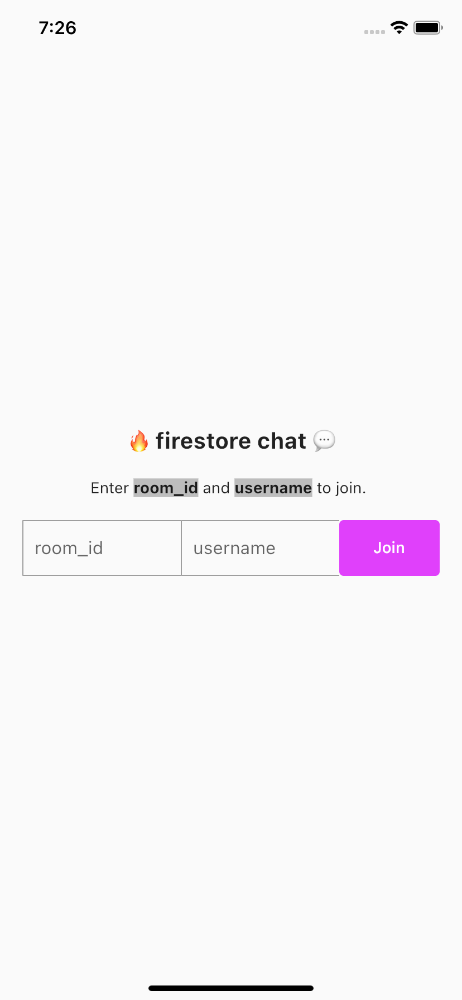

# Firestore Chat with flutter

Example project to show firestore chat with flutter. 

| Main Screen                         | Chat Screen                         |
| ----------------------------------- | ----------------------------------- |
|  |  |

### To Run:
- Copy `GoogleService-Info.plist` file to `ios/Runner/`.
- Run `flutter pub get` to install dependencies.
- Run `flutter run lib/main.dart` to run the application.